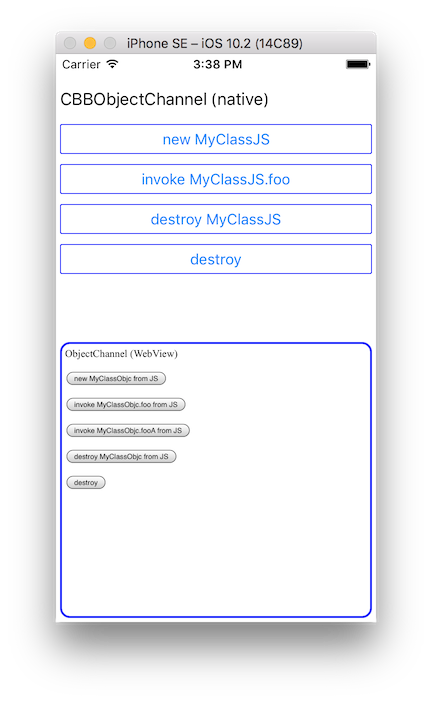

# <p align="center"></p>
ObjectChannelのiOS用の実装を提供します。

## Example
本リポジトリの [Example](Example) ディレクトリが, WKWebView(HTML) と ネイティブコード(Objective-c) 間の ObjectChannel で相互に オブジェクト生成, メソッド実行, 破棄 をする簡単なサンプル・プロジェクトになっています。
- Objective-c: [ViewController.m](Example/Example/ViewController.m), [MyClassObjc.m](Example/Example/MyClassObjc.m), [MyClassObjc.h](Example/Example/MyClassObjc.h)
- HTML: [index.html](Example/www/index.html), [script.js](Example/www/script.js), [data-channel.js](Example/www/data-channel.js), [function-channel.js](Example/www/function-channel.js), [object-channel.js](Example/www/object-channel.js)



Exampleをビルドして動作させる場合, 事前に `pod install` を実行してください。
```
cd Example
pod install
open Example.xcworkspace
```

## Setup 
### Podspec
```
abstract_target 'defaults' do
    pod 'CBBObjectChannel', '2.0.1'
end
```

## Usage
#### step 1: CBBObjectChannelの準備
使用するCBBFunctionChannelインスタンスを指定してCBBObjectChannelを生成します。

```objective-c
    CBBObjectChannel* objectChannel = [[CBBObjectChannel alloc] initWithFunctionChannel:functionChannel];
```

> DataChannel から FunctionChannel のレイヤを利用しない場合, それらを隠蔽した [`CBBDirectObjectChannel`](CBBObjectChannel/CBBDirectObjectChannel.m ) の利用を推奨します。
```objective-c
    CBBDirectObjectChannel* objectChannel = [[CBBDirectObjectChannel alloc] initWithDataBus:dataBus];
```

#### step 2: クラスを準備
ObjectChannel で利用するクラスは, FunctionChannel と同様, リモート側から実行できるメソッドを `CBBRemoteExport` を継承したプロトコルとして定義する必要があります。

FunctionChannel で利用するクラスと異なる点として, 戻り値と引数を持たない `destroy` メソッドをデストラクタとして定義できます。
```objective-c
-(void)destroy;
```

例:
- [MyClassObjc.m](Example/Example/MyClassObjc.m)
- [MyClassObjc.h](Example/Example/MyClassObjc.h)

#### step 3: クラスを登録
step 2 で準備したクラスを `CBBObjectChannel#bindClass` で登録することで, リモート側からオブジェクト生成, メソッド実行, 破棄 ができるようになります。

```objective-c
    [objectChannel bindClass:[MyClassObjc class]];
```

#### step 4: リモート側がbindしているクラスのインスタンス化
`CBBObjectChannel#createRemoteObjectWithClassName` でリモート側が `bind` しているクラスのインスタンスを生成できます。

```objective-c
    [objectChannel createRemoteObjectWithClassName:@"MyClassJS" arguments:@[@"arg1"] callback:^(CBBRemoteObject * _Nullable remoteObject) {
        self.remoteObject = remoteObject;
    }];
```

オブジェクトの生成が完了（または失敗）すると `callback` が呼び出され, その引数に生成したオブジェクトが指定されます。

#### step 5: リモート側のメソッドを呼び出す
`CBBRemoteObject#invoke` で生成したオブジェクトのメソッドを呼び出すことができます。

```objective-c
    [_remoteObject invokeWithMethod:@"foo" arguments:@[@"One", @(2), @"3"] callback:^(NSError * _Nullable error, id  _Nullable result) {
        // 呼び出しに成功時は error に nil が, result に戻り値が設定される
        // 呼び出しに失敗時は error にエラー情報が設定される
    }];
```

戻り値が不要な場合は, `callback` に `nil` を指定してください。

#### step 6: リモート側のオブジェクトを破棄
`CBBRemoteObject#destroy` でオブジェクトを破棄することができます。

```objective-c
    [_remoteObject destroy];
```

#### step 7: 破棄
`CBBObjectChannel#destroy` で, ObjectChannel を破棄できます

```objective-c
[objectChannel destroy];
```

> - ObjectChannelをdestroyしても下位層（FunctionChannel, DataChannel, DataBus）のdestroyは行われません
> - DirectObjectChannelを使用している場合, コンストラクタで指定したDataBusより上位層のdestroyは行われます

## License
- Source code, Documents: [MIT](LICENSE)
- Image files: [CC BY 2.1 JP](https://creativecommons.org/licenses/by/2.1/jp/)
